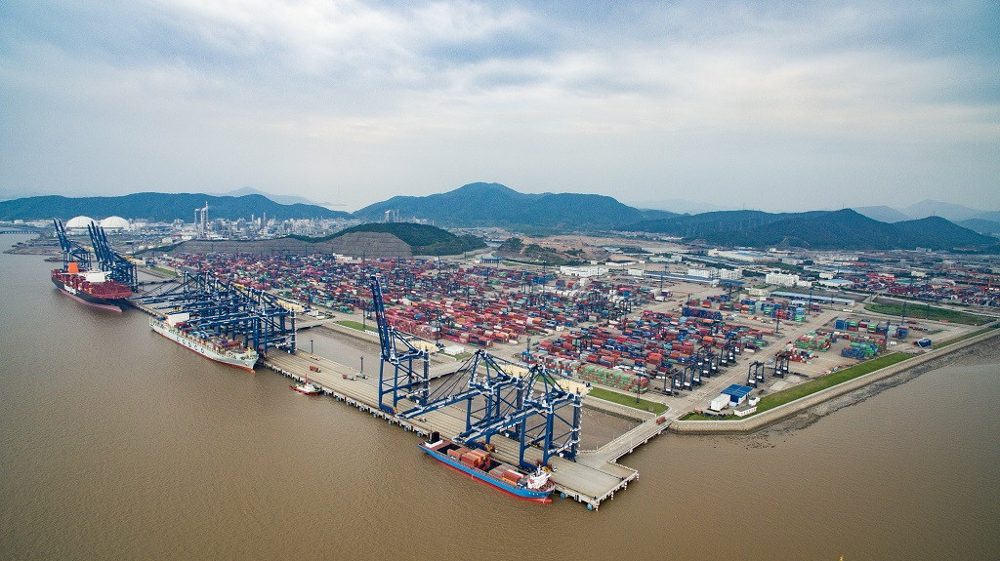
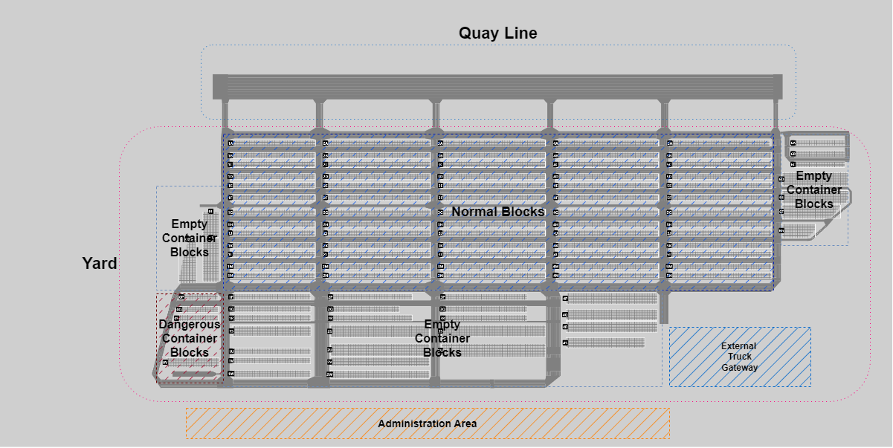
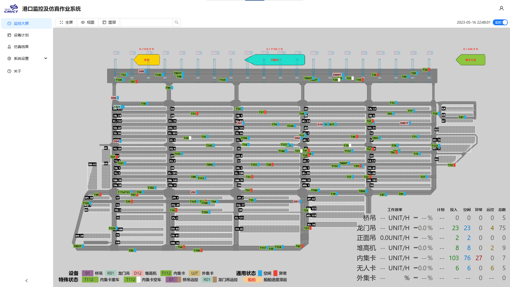
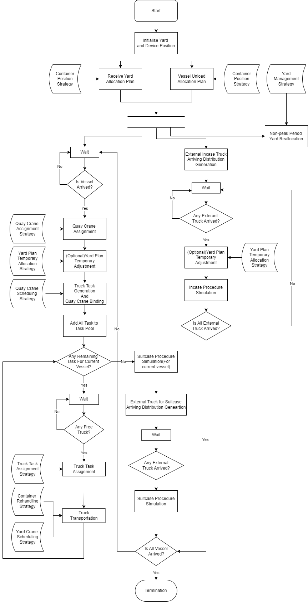
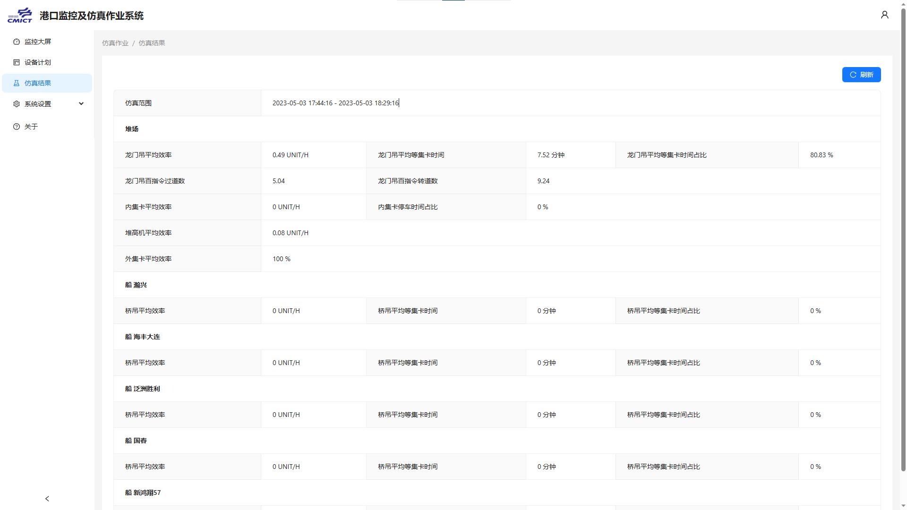
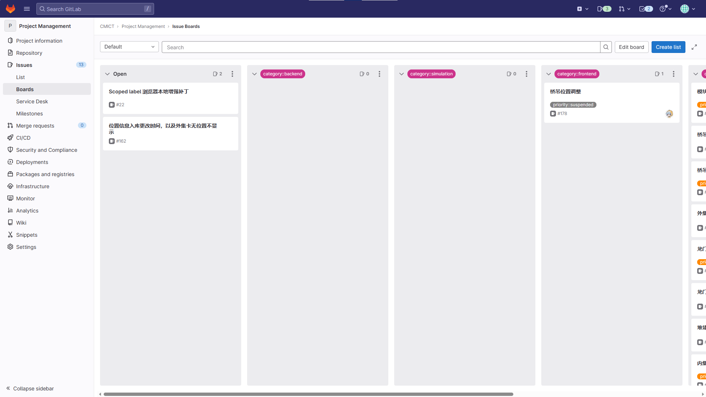
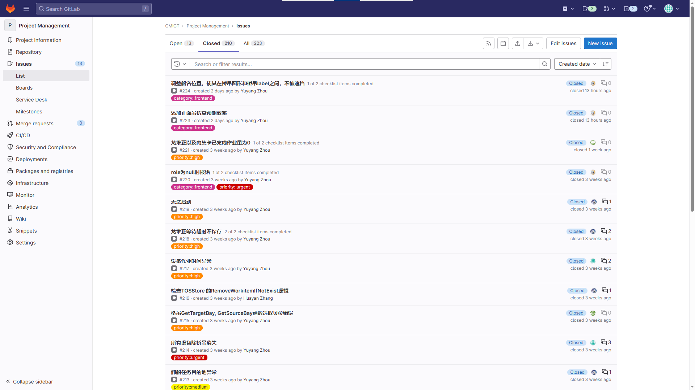

 <!-- with a server module as backend, a client module as frontend, and a simulation module. -->

CMICT Data Dashboard & Simulation Project: A Engineering Perspective Reflection
======

In the year 2022-2023, I participated the Ningbo Daxie China Merchants International Container Terminal(CMICT) Data Dashboard and Simulation project. This horizontal project 
is aiming to build a data monitoring dashboard and simulation to assist the terminal operator to have one-step view on
the terminal devices with KPI, as well as predict future terminal status by simulation. This project is aiming to 
build a solid cooperation basis between the UNNC Digital Port Lab and CMICT. I am mainly responsible for the monitoring backend and data 
adaptor module development. In some certain situations, I also participated in other works including requirement engineering, UI design and 
project management. In this part, I will first briefly introduce the project background, and then talk about the developed system. Since the project last
for almost one year which is beyond the prediction, I will then describe the whole development process with reflection. Finally, I
will summarize the experience that our team gained and gives some general guidelines on how such business-oriented horizontal project should be operated
in future.

## Project Introduction

<!-- This section will briefly introduce the project. -->

### Ningbo Daxie China Merchants International Container Terminal(CMICT)
Ningbo Daxie China Merchants International Container Terminal(CMICT)[@cmictNINGBODAXIECHINA2023] is located at Beilun District, Ningbo city.
CMICT has 4 container ship berths with corresponding facilities, which can serve up to 2 million tons vessels.
The terminal is built and put into use with a yard and road area of 839,000 square metres. The design capacity of the terminal 
is 2.4 million TEU per year. Recent decade witnessed a rapid growth of cargo throughout. In 2008, the throughout was about 1 million TEU.
The number grew three times, reached to 3.16 million TEU in 2018.

The terminal is highly digitalized. Most of the devices in terminal in the port, including 16 bridge cranes, 51 gantry cranes, 13 stackers, 116 
in-terminal trucks, are tracked and managed by terminal operating system (TOS). In addition, several assistant systems are deployed to 
help manage the port, including computer vision based intelligence cargo system, non-contact social truck gate tracking system, etc.  
The terminal is now seeking for cooperators that could help build intelligent terminal to improve the whole efficiency.

{#fig:cmict_layout}

### Data Monitoring Dashboard and Discrete Event Simulation

Data monitoring dashboard is a tool of visualizing business data and key performance indicator(KPI) that gives manager a clear view of system.
[@freiManagementCockpitsConcept2016]
As a useful facility for support decision-making, data dashboard provides a one-step view of critical statistics.  
A data dashboard has two major application: 1) help operators to build overview of system or business, therefore let the business growth or essential 
system faults could be identified. 2) display pre-processed measure for decision maker or stakeholders to understand business.
Specifically, the port data monitoring dashboard is a IoT-oriented dashboard, which is mainly used to display the device information and related KPI.
CMICT requires the system to be able to reflect the real-time terminal status, including the device status and KPI analysis. 

<!-- In this project, the data monitoring dashboard is used to display the position of terminal devices, including D -->

Discrete Event Simulation(DES) is a method to model real word systems. DES regards the system operation as a sequence of events in time, where each event is happened in 
a certain time point. Decision makers can predict the future system status by deduction the state changes given system behaviour modelling. 
In this project, one of the major requirement of simulation is to identify traffic jam road by extrapolating the terminal status.

### Team

The team is leaded by the Digital Port Lab in principle. During the whole development procedure, the team is mainly self-managed. 
There are 4 major members in the team, each is responsible for one certain part of project, all major members are PhD students in Digital Port Lab.
The major members include:

**Project Manager**. This role is responsible for communication, product prototype design and progress management. He is also responsible for managing   
communication documentation and meeting. Due to personal issue of team member, this role was taken by Chen Xinan before August, and then Zhou Yuyang.

**Frontend Developer**. This role is responsible for front-end development to satisfy the stakeholder's requirement, including some detailed data dashboard user interface design, 
frontend functional development, and backend interface docking. This role is taken by Zhu Junsong during the whole development progress.

**Backend Developer**. This role is responsible for back-end development, that provides pre-processed data API to frontend dashboard, and provide input/output 
communication to simulation. This work is mainly taken by me during the whole development progress.

**Simulation Developer**. This role is responsible for simulation model design and development. The work is quite idle comparing with frontend and backend development once 
input and output format is defined. This work is mainly taken by Jin Chenwei while some structure design by Jin Jiahuan.

Apart from the major member, the team involved several temporary members at some special 
time point. Those temporary members and works done will be described in development procedure.

## CMICT Port Operation Logic

Despite different type of ports exists in Ningbo, CMICT is a typical maritime container port.
A maritime container port is the transhipment where containers exchanging between container vessel and land vehicles, or between container ships happens.
As one of the most important global supply chain gateways, CMICT receives cargo from international container vessels, and dispatch them to domestic 
receivers. Besides, it also provides other derived functions such as container storage and domestic container transportation. 

{#fig:operation_model}

[Figure @fig:operation_model] briefly represents how a common container port works. 
Once a vessel arrived, it will stop at a certain berth. The quay cranes will lift the containers from the vessel then put onto an internal truck, or vice versa.
The internal trucks will carry the container between quay cranes and yards. In the yard, a yard crane will transfer the container between 
the yard and trucks. External trucks will also transfer containers between the yard after check in at the container gate. Specifically, 
the container in the yards will be reallocated due to efficiency issue. Such tasks will be executed by yard cranes and internal trucks.

<!-- LTeX: enabled=false -->
<!-- \begin{figure}[htbp]

\hypertarget{fig:operation_model}{%
\centering
\hfill\break{\centering\includegraphics{../images/Port-Operation-Logic-SimpleLogic.pdf}}
\caption{Maritime Container Port Operation Model}\label{fig:operation_model}
}
\end{figure} -->
<!-- LTeX: enabled=true -->

### Physical Port Area

{#fig:port_area}

CMICT has total 1.657 million square meters area with four deep water berths. The quay line is 1500 meters long with 17.5 meters water depth.
[Figure @fig:port_area] represents a top-down view of the port area. The port area can be briefly divided into four parts:
<!-- Figure~\ref{fig:port_area}  -->

1. **Quay Line**: Quay line is the place where container ship stop at. Usually the vessel is stopped at certain berth 
place according to vessel plan. The quay cranes are located at the quay line, execute container transportation
between container vessels and internal trucks. The quay lines are connected to the yard by six bridges.

2. **Yard**: Yard area stores containers for further dispatching. The yard is divided by vertical and horizontal roads which allow trucks to move. The
blocks which store containers are the areas surrounded by roads. 
The yard blocks have three types: the normal blocks, dangerous container blocks and empty container boards. A normal block is the yard that stores both
empty container and full container, which is located at the centre of yard area with standard layout. An empty container block stores empty containers only.
They have non-standard layout, located at the surrounding of normal block area. The dangerous container area stores cargos that could cause potential 
danger if not stored properly.

3. **External Truck Gateway**: The external truck gateway is located at the bottom right of the yard area. It contains two parts: the truck gateway, and a parking area for external trucks.
Once an external truck arrived, it will firstly be checked in by the gateway, then go to the park until working tasks are assigned. The external truck will then go to target 
yard to load or unload containers. 

4.  **Administration Area**: The administration area is located at the bottom of the whole port area. It contains the administration building for the whole port,
the customhouse, and container freight station. The project does not involve this area much because it does not have much influence on the whole container transportation flow.

<!-- LTeX: enabled=false -->
<!-- \begin{figure}[htbp]
    \label{fig:port_area}
    \centering
    \includegraphics[]{../images/PortArea.pdf}
    \caption{CMICT Port Area}
\end{figure} -->

<!-- LTeX: enabled=true -->

### Container Transportation Equipments

Container transportation equipments are devices that executing the container transportation tasks. The container transportation task is the minimal unit in the whole port execution.
An ordinary container transportation task can be described by six elements: the container unique ID; the source and target position of the container; lifting, carrying, and putting device.
When executing an ordinary container transportation task, the container will be moved from source position to target position. The lifting device will put the container onto the carrying truck. Once the truck arrived, the 
container will be unloaded and put to target position by putting device. The start and end time of lifting, carrying and putting will be tracked and recorded. The whole 
task will not be considered as finished until the putting section ends. All devices involved in the container tasks are called container transportation equipments (CHE).
Specifically, although not owned by the port, we will include container vessels and external trucks in the discussion. There are mainly four kinds of container transportation
equipments:

- **Vessel and Quay Cranes**. When the berth is stopped at the berth assigned, it will not move until all tasks finished. Then several quay cranes will be assigned to the vessel.
The unloading tasks will be executed first. When an internal truck arrived, the quay crane will lift the container from the vessel, put it onto the 
truck. Then the truck will carry the container to target yard, and the quay crane will serve for the next truck. Similarly, when executing loading task,
the quay crane will lift the container from truck to vessel. Apart from loading and unloading containers, the quay crane also executes some assistant tasks, which
will be counted while calculating quay crane efficiency. There are some extra rules for quay cranes. First, the quay crane is ordered, and they can not be assigned
across the berth because the size of quay crane is too large to exchange location. Second, to balance the efficiency, the quay crane can be reassigned to the berth
next to the current working berth. CMICT has a 1.5 km quay line with and 18 quay cranes currently.

- **Yard Cranes and Stackers**. The yard cranes are used to lift and put containers. 
It is possible that one yard is assigned with multiple yard cranes, and one yard crane is shared by multiple yards.  
For efficiency purpose, the container will be reallocated within or between yards. The reallocation works within yard are executed by yard cranes by simply lifting
the container and putting to target location. If the container will be moved to another yard according to plan, an internal truck will be used to carry the container.
In CMICT, apart from standard yard crane, several stackers are also used similarly as yard cranes but only for empty containers. Besides, some of them are remotely controlled by the operators.

- **Internal Trucks**. The internal trucks are trucks that carry containers within the port. Their movements are strictly controlled by the port traffic rules, like the speed limitation.
When a task is assigned, the truck will first go to the lift position, wait the container to be putted on the trailer and move to the target position. When the truck
arrived at target position, it will also wait until the container is finally located at target position. In CMICT, some AGVs are also used as internal trucks.

- **External Trucks**. External trucks are trucks that imports and exports containers between port and other land logistic nodes. Despite some special case, an external truck 
carries a 40-inch standard container or two 20-inch standard containers. When an external truck come to the port, it will first check in at 
the gate, then go to target yard to unload or load containers. It is possible that one external truck involves both import and export tasks,
and involves multiple containers. When multiple tasks involved, the truck will not leave the port until all tasks finished. 

## Nottingham Terminal Surveillance Suite(NTSS)

The project is aiming to satisfy the needs of port production environment. The feature includes ensuring the monitoring of port devices, analysing the real-time operation of the port, 
illustrate the operational indicators of the port. On the other hand, the existence of barrier between different digital sub-system in the port prevents the integration of sub-system, 
therefore reduce the usability and weakens the effectiveness of operation analysis. The project is also required to integrate data from several sub-systems to bypass the data barrier,
to provide a holistic view for port operation and decision-making.

Based on the requirement, we design the system to be a Browser-Server architecture. A web browser based frontend is used to provide an aerial view of the port with real-time device position,
work status, and necessary configure operation. A backend server reads data from sub-system in CMICT, calculates necessary measure and prepare terminal snapshot for the browser and 
simulation. A stand-alone Anylogic simulation model is developed to make prediction of future terminal status. The input, output and execution of simulation model is controlled by backend
for automatic prediction.

The rest of this section will discuss and analysis the detailed design of each module. 

### Backend

The main function of backend is to synchronize data between three CMICT systems, analyse them and provide data pack for frontend display.
Besides, the backend also provide a set of basis system management functions including user management, configuration, and planning. [Figure @fig:backend_structure]
represents the data interaction between the NTSS system and external systems. 
NTSS Backend grabs data from CMICT data source, transform them to standard data formulation, and then store them in NTSS internal storage.
The core data structure is the terminal snapshot, which stores all terminal status at a certain time. 
The analyser will read stored data from internal storage, analyse them and generate terminal snapshot.
The terminal snapshot is then be transformed to frontend-friendly data pack and send to frontend to display by the 
API controller. Since the simulation system also need to initialise system with terminal status, the terminal snapshot is also 
provided and transformed for simulation. 

NTSS backend is based on Microsoft Entity Framework Core 7.0, with a SQL Server database. 
These development choices are made mainly for the development team is familiar with this technique stack.
Other components like HikVision development kit and LDAP library, are introduced for specific feature requirements.

{#fig:backend_structure}

[Figure @fig:backend_module_arch] represents a brief architecture of NTSS backend. The dot-dashed part represents external systems and dashed rectangles represent
different layers in NTSS backend. Cylinders represent data storage including database or data file, and trapezoids represent data model for internal storage or 
data transfer.

CMICT provided four heterogeneous data source which are all used by the 
NTSS, including different database access, third-party API and development kit, which increased the difficulty of data loading. 
The TOS database stores the operation data for the whole port in an Oracle database. The CTISTS database stores the data in 
intelligence tally system in a separate Microsoft SQL Server database in addition. The two database are connected while port operating, but the logic
is not shown clearly to our development team. The position API is developed by third-party system developer with a Websocket
publish service. Finally, the surveillance video is provided by HikVision system whose access is provided through HikVision Development Kit.

To implement basic reading and data unification, the data provider layer is designed. In NTSS, we define data transfer objects(DTOs) as a set of object definition 
independent of data definition provided by data source. Therefore, the synchronisation, analysis and data transformation are able to perform based on 
the unified DTOs regardless of difference provided by data source.
A data provider is associated with a certain data source, implementing the data access function and transforming original data to DTOs.
Specifically, the data access and data manipulation is executed through a specific core provider, which associates with NTSS internal database and
implements create, update, delete, search operations for DTOs. It will also analyse the status of port, provide simulation initial status for simulation 
and port snapshot for NTSS frontend.

 <!-- The mapped DTOs are then synchronised with internal storage with data loaders. -->
To ensure the usability of backend system, the NTSS backend is designed to be microservice architecture. 
By definition of microservice, the services plays role to run a set of specific commands which does not share same 
program context. Therefore, if any service is broken, it will not affect the execution of other services.
In NTSS context, these services belongs to service layer, including web service, data loaders and simulation executor.
Web service is the core service of NTSS backend, it provides port snapshot data packs to fronted, and interacts 
with user through web APIs.
Three loaders are responsible to monitor the change of data sources and synchronise them with internal storage.
The simulation executor initialise the simulation state, execute simulation with given configuration set and store the 
result for frontend feedback.
NTSS specific data storage. Therefore, if any synchronisation service is broken, the web service can still provide data to frontend using 
synchronised data in individual storage. The web service is the core service that provides the port snapshot to frontend and interact with user. 
Additionally, since the surveillance data are provided by HikVision, it is processed separately with HikVision surveillance SDK.

{#fig:backend_module_arch}

Vertically, this architecture decouples the association between analysis logic and original data representation. The NTSS backend is 
therefore able to break the data barrier between the CMICT data sources. Horizontally, different data source are treated differently to 
make the system able to extend in future. The usability of web API is also ensured by the microservice architecture. Plus, the separation
of each service make it possible to reduce the risk of whole synchronisation broken by a sub-system problem like network error, etc.
Overall, NTSS backend provides the required functions, with usability and future extension considered.

### Frontend Client

The major function of frontend is to display the real-time port status to the user. Apart from that, the frontend also 
provide interaction pages for system setting, user authentication, surveillance video entry, simulation result and other assistant functions.
The frontend architecture is designed to be three layers as shown in [@fig:frontend]. The frontend also uses the React framework 
for fast development and three.js for rendering the port objects.

The NTSS frontend client has three layers: the API layer, the store layer and web page layer. The API layer takes over 
requests and responses between the frontend client and backend. The functions are grouped by module to match the backend API set.
To persist critical data, including the status of authentication and port snapshot, a store layer is designed. The authentication
data is stored to ensure the client is at login status until user log out. The port snapshot is stored and updated based on regular 
time period, to update the page representation. Additionally, some frontend specific data is calculated and stored by the store layer.
Apart from the store layer, some API directly forward the data to the page level since these data are not as complex as port snapshot, or does not 
require persistent storage. Finally, there is a web page layer that implements the direct interaction page with user. The monitor page renders the position
of devices and vessels in the port and displays related statistic information. The simulation and surveillance directly displays related information 
to the user. Counterintuitively, those two pages simply represents the data by backend without much processing, for the related data structure or
media can be easily handled by the browser. The authentication page and setting page implement management features for the whole NTSS system 
by interacting with backend interfaces.

{#fig:frontend}

[Figure @fig:frontend_screenshot] represents the core port monitor page. 
On the top-right, there is a button to switch between real-time and history mode. 
The top-left part controls the main view, including full-screen switch and device filter. 
The page switch buttons are placed on the left panel. The rest part represents the monitor 
body. The port overview represents a scaled port with the quay line on the top horizontally.
The vessel and devices are located according to position data from backend, which is part of the snapshot.
The legend of device representation and status are located at bottom of the screen.
The bottom-right part represents the efficiency and tendency of current work group, and devices count at different status.
During the system running, the frontend will continuously request a full snapshot to represent real-time port status to backend after a certain synchronisation period.
The new snapshot will then be merged to the stored snapshot, and be rendered to the page. 
On the other hand, since the data definition of port snapshot is same, the monitor page 
can render the port status at any time as long as the backend is able to provide snapshot.

{#fig:frontend_screenshot}

### Simulation

Although port simulation itself is a big research topic, in current stage of NTSS, the role of port simulation is simple:
to provide a near-future port efficiency prediction. Consider the nature of port operation, the simulation is a discrete 
event simulation based on AnyLogic. 

The interaction of simulation and other modules is simple.
The simulation reads the initial state and configuration from NTSS backend, and exports the simulation results. Both input
and output are in JSON format for reducing development complexity. The starting and ending of simulation is monitored by the NTSS backend service.
The result will finally be sent to frontend to represent the result.

The simulation focus on the scheduling problems in the port. 
[Figure @fig:simulation] represents the simulation workflow. 
The simulation will first initialise the device position, container position and planned tasks. The containers will then be 
reallocated according to reallocation plan from the plan list. Then, three steps are executed in parallel, including quay line tasks,
external truck tasks and yard adjust tasks. When any vessel arrived, it will first be assigned
with several quay cranes according to quay crane assignment strategy. After which, a series of load and unload tasks are assigned and scheduled with 
quay crane scheduling strategy. The system will then try to find free internal trucks, and assign truck tasks to carry the container 
to target location. Such carry tasks will be generated and assigned by the truck task assignment strategy. At the yard side, the simulation 
is executed according to container rehandling and yard crane scheduling strategy. For external trucks, the arrival of trucks not in port is 
simulated by a learned probability model. When one external truck arrived,
the container import tasks will be executed first and then export tasks, if any.
Specifically, when it is non-peak period or necessary, a small yard reallocation procedure is involved to improve efficiency.

{#fig:simulation}

As shown in [Figure @fig:simulation_result], the export result contains efficiency of yard and each vessel. 
The yard efficiency involves average efficiency for each type of device in the yard, and waiting times.
For each vessel, the average efficiency of quay cranes and waiting times are considered.

{#fig:simulation_result}

## Reflection

By the time of report writing, the project is at the User Acceptance Test stage. The system is connected to 
the production database, and the correctness of analysis is tested. 
So far, NTSS has implemented major features with required system performance, but there are still some inconsistency of 
data display or efficiency calculation. 
The volume and workload of NTSS is far beyond
the exception. For example, although not finalized, the NTSS backend has over 58000 lines of code, the frontend has over 40000 lines of code.
The whole development period lasts over one year, at least is twice than expected. The delay is mainly due to  
several shutdowns caused by COVID, and lacking of business level development experience. 
In this section, the development procedure will be introduced, and analysed from three aspects: the external factors,
software engineering principles and human factors.

### Development Procedure

At the beginning of development, the development period was designed to be 4-5 months, which involves 1 week requirement and set up, 
9 weeks of development and 2 weeks of testing. The development started from February 21st 2022, the first several weeks went smoothly.
However, at April, the university was shutdown due to COVID, which stops the face-to-face communication between the develop team and 
CMICT. Moreover, in this period, CMICT does not provide the access of test database due to data access control reasons. These two factors heavily delayed the development progress
and also reduce the quality of software, for the development team can not get on time feedback from CMICT. We would like to highlight the 
accessibility issue of the data: at that stage, the development team have nearly zero knowledge on the port data source, except several documents
describing the database table names and related fields. The inaccessibility of database results two factors: first, an extra test database is established,
second, the development database for the development is inconsistent with the target data source. 

The second development stage was from mid-May till first week of August, several data access is provided in this stage, so the development was pushed forward quickly.
The VPN access and TOS test database access was provided in mid-May, then CTISTS (intelligent tally system) test database and surveillance API access was provided in mid-June. The position 
API was not finished developing at this stage. At the beginning of this project, CMICT was promised to provide a set of data source as API form with efficiency calculation
for the NTSS, but in this stage, the data source is finalised as database access. This change actually shifts the responsibility of ensuring data correctness from CMICT to our development 
team.  The development team was focused on the development document writing, 
mainly the requirement document at the window period before the data access is approved by CMICT. 
By the end of May, an early version of requirement document is finished. 
In this stage, CMICT requires the document and prototype for inner evaluation. Therefore, the development plan is rearranged to achieve a prototype version at the end of July.
In this period, the system architecture has changed because of the size of TOS data: it contains over 10 years execution records, the original design is not able
to implement required features satisfying the performance requirement. Also, the simulation module is developed independently to verify the simulation logic.
The development team submit the document set and software delivery including both frontend and backend at this stage. 
Unfortunately, both document and software delivery was received negative feedback. 

The third development stage started from mid-August to end of October. 
This stage focused on connection from backend, and implement interface between backend and simulation. 
The university controlled the returning to campus strictly due to COVID situation and government policy, this also increased difficulty of
communication. Due to the previous stage low quality of documents and exchange of team member, in this stage not much document works are involved.
In this stage, the production data source read access was provided to verify the data in real time,
the production position API is also implemented in this stage.
The critical difficulty in this stage is the frequent changing data, and the data volume in production environment. 
The position data can have over 100,000 lines per day, which causes heavy storage space and search computability. 
Furthermore, the third party position API is not stable, therefore the whole system is under high risk of suddenly shutdown or slow response.
The CTISTS production database is also not consistent with test database. This inconsistency also caused a nearly whole re-write of logic.
By the end of this stage, the system design had been changed several times, which causes any alter of logic or bug fix become very slow. The major features are
implemented, but the system performance and stability are big issues.

The third development stage started from November till early March 2023. In this stage, the team decided to refactor the system to be microservice and unify the 
backend-frontend request to be a single snapshot object. At this time, the university faced another shutdown in the end of November, and the pandemic situation
leaded to group isolation and early end of autumn semester. Fortunately, the isolation and early stop of semester brings more flexibility of pushing forward the 
project. Although most of the team member suffered from COVID heavily, a fully rewrote version was able to finish before the spring festival. This version implemented
the NTSS architecture, with improved stability and extendability than the old version. 
After spring festival, the team worked on finishing some support features and document writing to summarise the project. 

The final stage started from March till now. This stage the team focused on pushing the system to the final state. The major part of this stage is in-team testing and 
CMICT verification. Comparing with the 2-week testing period in the original plan, the actual testing time is surprisingly caused nearly 2 months. During this stage,
over 200 issues, including frontend, backend and simulation issues are fixed. These issues include data inconsistency, specific data handling, efficiency calculation issues, frontend display issues
and other stuff are solved. Over 15000 lines of code is added to fix the issues. This stage is also actually the team started to follow a certain software engineering workflow,
 which obviously improved the efficiency of teamwork. 

### External Factors

To summarise our development procedure, two critical factors heavily affects the development workload and time cost. Firstly, there are two shutdowns 
and several entrance controls during last year due to COVID, in total nearly 3 months. These let the face-to-face communication became hard, and at some
special cases the development is hard to push forward.
Secondly, the data source access provided by CMICT is heavily delayed, besides is not aligned. 
Although the data field description document is provided, it is hard to development the system only by the document.
There are lots of trivial cases of data that need to be reviewed carefully only with real time production data.
Therefore, the delayed data access directly delayed the development progress. The non-aligned access also have negative efforts on the progress with similar reason.
The test data does not reflect the detailed encoding and data structure of production data, as well as the data manipulation. This causes lot of issues that works with 
test data but failed at production data.

### Software Engineering

Software engineering is something that can not be understood until a practical project is executed.
Although at least two members in the development experience of commercial project, this project still beyond our experience.
Therefore, the reflection on software engineering aspect is important for future academic development or practical projects.
Actually, we believe this is the most valuable experience we could get from the NTSS project.

We would like to highlight three issues of software engineering that could be improved: the documentation work, the project procedure control
and software quality control. These issues are critical to the development progress and delivery quality. In fact, most of them have been already 
discussed by many developers and engineers [@brooksMythicalManmonthEssays1995], but the reflection with project associated is still important.

**Documentation**. Developers usually does not like documentation, but it reflects how the developer and team understands the project and track the development progress.
For teamwork, a proper set of document can help other members understand the big picture better. In this project, CMICT criticized the document writing,
especially the requirement document. As described before, the project manager is the one who should write the requirement document, 
because he needs to analyse requirements, discuss with the team and decide how the systems should be developed.
This requires the project manager to have best understanding to the requirement, therefore he has the authority to answer all the requirement related questions in the team,
and able to reject improper additional requirements.
However, in NTSS, the requirement document is simply delivered by the project manager to the developers, and ask them to finish. This does not only lead to the low quality of requirement
document, but also let the project manager not able to control the requirement. Therefore, two serious aspects happened: from the CMICT prospective, the requirement document 
was considered as just a copy of what CMICT provided, without understanding; from the team prospective, the whole big picture was lost, and the negotiation between CMICT and 
development team is failed. 

**Procedure Control**. The procedure control involves two aspects: to plan how the development should move forward, and to summarise the development result. And the procedure control
should be reviewed every single development section. In the agile development methodology, the progress will be reviewed every sprint(2-3 weeks) and be emphasised every day. In the progress 
of NTSS development, there are some planning at the beginning of each stage, then the plan execution is badly tracked. From the prospective of developer, every development stage
literally tons of tasks and requirements came in every week, even every day. What is worse, those tasks or requirements usually without detailed description and importance level, 
therefore it was hard to make development plan, not to speak of tracking and reviewing. The myth from the stakeholder that: "although the development is behind of schedule, it could 
be finished by next week" added to this situation, which let the team try to finish everything by working overtime. When reviewing from this point, such overtime working does not 
improve the progress much but only add extra fatigue and anxiety of the team. In the end, the development was still cost at least twice the planned time, 
regardless of COVID period. 

Things did not improve better until the team followed a workflow based on GitLab at the last stage. The workflow first requires the project manager describe the issue(features, bugs to be fixed) properly, and put 
the issue in the issue pool. The board representing category and tags to mark priority are applied to manage the issues. The developer then go to the issue pool to identify and discuss the issue. Once 
an issue is solved, usually involves an implementation of feature or a fix of bug, it will be notified to the project manager and closed if approval. 

This is a simple workflow but still cause the team about 1 month to master. A major difficulty is how to describe the issue properly so that a bug can be fast identified: 
the project manager or the tester's view usually does not fully match the developer's. A common mistake is the bug is described by just a single line of words or a screenshot image, which 
does not help the development. Again, we would like to reference it to the documentation issue: the improper document make the task hard to plan and not trackable, therefore the 
progress will likely be out of control. 

{#fig:issue_board}

{#fig:issue_list}

We found several statistics is important in the software development practice. First, a development period of a normal feature will last 2-3 weeks, regardless of overtime working.
Second, during the development time, only 50% time should be use on coding, the rest workload should be on document writing, meeting and detailed development design. Third, a reasonable
workload is about 100-150 lines of code every day for a developer, this count will reduce when the system is becoming more complex, for the developer need to understand more code.
What's interest is some of them is actually be described by @brooksMythicalManmonthEssays1995. 

**Software Quality Control**. The project did not be test properly until the end of stage, and the quality of software deliveries are often criticized by CMICT. 
We conclude that to improve the software quality, two critical things must be done. Firstly, the system must be well-designed at the beginning of development. This requires
good understanding of requirement, and rich system design experience. Unfortunately, from previous discussion, it is clear that both of them are not fully achieved in this project.
The design stage is only a very small part of first week according to the original plan. Actually, the final NTSS architecture was forced to be designed at the stage that further 
change on the system became too heavy to afford. 

The final stage was focused on the testing, but if the unit testing is done properly, some problems can be identified early to reduce the final testing cost. The unit testing procedure
can be described as follows: when part of system functions is confirmed, the test case can be designed according to system specification and edge case. The feature must pass the 
related unit test after development or alter. Similarly, ideally the system should pass all unit test. Apart from the early testing feature, unit testing can also force the 
test case writer to think the problem at programming level and have proper understanding of requirements. Therefore, this will help unify the big system picture and improve communication 
inside the team. From the programming level, unit testing will change the design of code to make it open for testing, which will improve the whole structure. 
Due to time limit and legacy code, the team only made small attempt to apply unit testing. However, we believe this methodology should be applied in future development, both in engineering project 
and academic developing. The time cost on writing unit testing will delay the development, but provide better structure and ensure software quality. According to @brooksMythicalManmonthEssays1995, 
a proper time plan is 1/3 planning, 1/6 code writing, 1/4 unit testing, and 1/4 final regression testing.

### Human Factors

Even we are now reaching the age that ChatGPT could help the user to write code, it is still the developers that combine functions, classes, code snippets, modules, libraries organically to form
runnable code. Especially for large-scale projects, no silver bullet exists. Therefore, one should pay special attention on the human factor in the software developing progress. 
In this section, we would discuss three important factors in current and future projects.

**Purpose**. One start programming usually based on three purposes: 
    1. Programming is necessary to achieve certain requirements; 
    2. Programming production make economic benefits;
    3. The developer can gain mental happiness like creation or constant learning.

Purpose 1 and 2 are mainly external factors. Purpose 3 is highly related to intrinsic motivation of developers, but can be easily eliminated by improper project management, ineffective communication,
etc. If such motivation is low, the programming will become tiring and boring, therefore reduce productivity. We would expect the future project can satisfy the three motivation.

**Leader**. The leader plays important role in the software development team, for he is responsible for requirement and system definition, communication between team and stakeholder, and control progress, cost and quality. 
The leader does not need to write code, but he should be the one that can control and assign all the development resource, including human resource and assets. 
The role that the team leader plays is so important that he must have strong authority to control the team, especially considering the developers usually have strong personality.
The leader's authority does not naturally from the position he at, but from good understanding of the requirement, proper progress management and effective communication. The kindness and technical excellence would improve 
the authority but not critical. In this project, we do not have a single person take the responsibility of leader. Theoretically, the project manager should take the role, but both of them 
failed to prove they are qualified for this position. The lacking of leader is a potential risk in future teamwork.

**Teamwork**. The teamwork itself is one of the critical source of development complexity. Therefore, effective communication and cooperation is important. The improper communication will not only cost 
more time to understand, what's more risky is when misunderstanding happened, it might directly lead to a development failure. 
In this project, from personal view as a backend developer, I had good communication with frontend and simulation developer. The most serious ineffective communication and misunderstanding happened
between the project manager. How to achieve good teamwork is still a great topic in management field, here we just list some importance experience:
1. Ensure each member is responsible to his job. It would be better if one show he is willing to help others in the team.
2. There are many roles in the team, but a common big picture of system and project is important.
3. Communication, especially meeting, should be quick, direct to the critical part. The meeting should be held only necessary.
4. The communication complexity will increase exponentially with the size of team increasing. As @brooksMythicalManmonthEssays1995 emphasised: Adding manpower to a late software project makes it later.
5. A meeting taking about too detailed stuff should be considered as bad. Effective meeting must come up with executable plan or actions.
