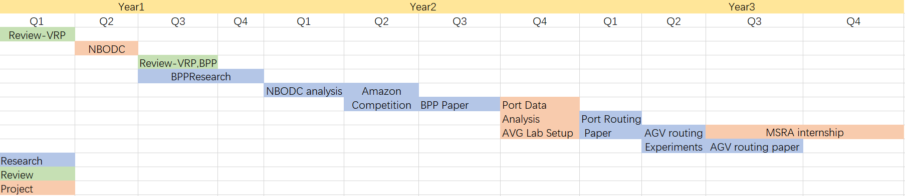

Plan and Future Works
======
This section will briefly discuss the plan execution status this year and plan for
incoming year. Figure below represents the PhD lifecycle plan. Currently, We are
at the end of Quater 3 of Year 2.

## Review works in last year

Comparing with last year plan, the NBODC research and related paper was
cancelled. This is mainly because of the insufficient data from Ningbo
government: the related data interface was closed, and we discussed with the
staff of the authority, they refuse to provide any techincal help. The AGV lab
setup was also delayed due to several issues, including the administrative work
in and out of campus. The COVID problem in Ningbo at Dec. 2021 also delayed the
progress. We plan to finish the set up of AGV lab in Quater 4 of year 2
(March-May 2022). The bin packing research was also delayed & broke into two
part because of 1) we plan to participate the Amazone Last Mile Routing
Challendge in the middle and
2) the main methodology was changed. We was planning to build a pure DRL
19
Solving Combinatorial Optimization Problem with Deep Reinforcement Learning
method for BPP first which is considered as continuous work of a final year project,
but after finished the Amazon Last Mile Routing Competition, I have discussed with
the supervisor to change the idea based on pricing and column generation. Therefore
the switch of methodology took time on experiments and paper writing.
We have participated Amazon Last Mile Routing Challendge and came up with
several models. Unfortunately we failed to gain a good ranking, but we gained good
experience on uncertainty involved routing problem. I would also like to point out
that due to the decision of participating the competition is late, we have only 5 weeks
for the whole competition (the whole competition lasted for 3 months). Under that
circumstances, we did our best.

## Future Plan

