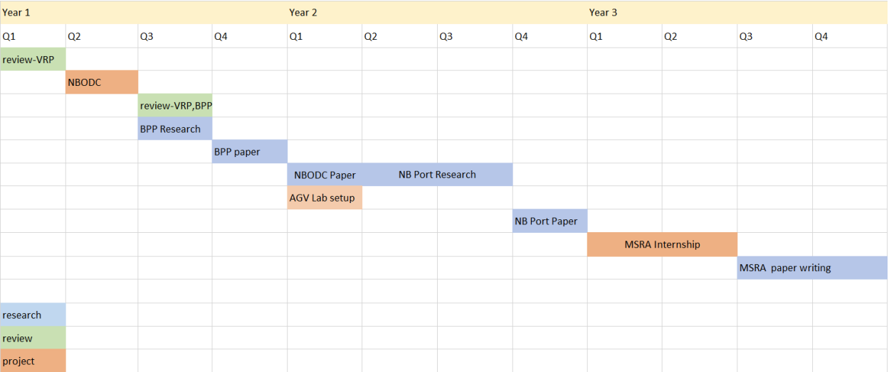

Plan and Future Works
======
This section will briefly discuss the plan execution status this year and plan for
incoming year. Figure below represents the PhD lifecycle plan. Currently, We are
at the end of Quater 3 of Year 2.

\begin{figure}[htbp]
    \label{fig:plan-y2}

    \centering
    \includegraphics[]{../images/plany2.PNG}  
    \caption{Gantt chart for Year 2}
\end{figure}

## Review works in last year

Comparing with last year plan, the NBODC research and related paper was
cancelled. This is mainly because of the insufficient data from Ningbo
government: the related data interface was closed, and we discussed with the
staff of the authority, they refuse to provide any techincal help. The AGV lab
setup was also delayed due to several issues, including the administrative work
in and out of campus. The COVID problem in Ningbo at Dec. 2021 also delayed the
progress. We plan to finish the set up of AGV lab in Quater 4 of year 2
(March-May 2022). The bin packing research was also delayed & broke into two
part because of 1) we plan to participate the Amazone Last Mile Routing
Challendge in the middle and 2) the main methodology was changed. 

We was planning to build a pure DRL method for BPP first which is considered as
continuous work of a final year project, but after finished the Amazon Last Mile
Routing Competition, I have discussed with the supervisor to change the idea
based on pricing and column generation. Therefore the switch of methodology took
time on experiments and paper writing. We have participated Amazon Last Mile
Routing Challendge and came up with several models. Unfortunately we failed to
gain a good ranking, but we gained good experience on uncertainty involved
routing problem. I would also like to point out that due to the decision of
participating the competition is late, we have only 5 weeks for the whole
competition (the whole competition lasted for 3 months). Under that
circumstances, we did our best.

\begin{figure}[htbp]
    \label{fig:plan-y1}

    \centering
    \includegraphics[]{../images/plany1.PNG}  
    \caption{Gantt chart for Year 1}
\end{figure}
<!--  -->

## Next-step Plan

Currently, the nearest project is finishing the cooperation with Ningbo Port(Zhaoshang)
to build a big-screen management system for NTOS. This project consists of several parts:
data read and analysis module, frontend display module, backend module and simulation module. 
I am in charging of the development of data module, including data reading from remote API,
storage and preprocessing. The data will later used for big-screen display for decision maker
to review and analysis the port status. We will also use this data to build port simulation 
and analysis dataset for further research. We list several key milestones below. This might
change depending on the progress, but will roughly represent the plan.

1. Data API definision: 8th March
2. Sample interface data and test: 28th Marth
3. Finish system development and test: late April

The AGV lab set-up progress is now waiting for furnitures and facilities engineering to finish.
The development of AGV simulation and interface connection between simulation
and AGV management system is on-going to parallel use time of waiting facilities.
Once the connection finished, we are able to do some theoretic research based on simulation.

The next-step research step will focusing on AGV routing problem and hopefully
will finish 2 papers in incoming year. Comparing with vanilla VRP, this kind of problem 
usually based on a graph representation of traffic net with multiple vehicles. The 
algorithm need to deal with confilict/dead lock and load balance to avoid traffic jam, in some
special case time window will be considered[@naiqiwu_agvroutingconflict_2003, @mohring_conflictfreerealtimeagv_2005, @smolic-rocak_timewindowsbased_2010].
Firstly, with the data by Ningbo Port
(Zhaoshang), we are able to study port routing problem with real-world
dataset and identify more specific application scenario. This requires
understanding the logic of port management and related data. Since it is highly
connected to the big-screen system development, we will start research once the
data module is finished. Roughly, the data module will finish by mid or late
April, we will start literature review by March and start experiment set-up from
late April. The experiment and writing will approximately take 2 months and in
total 3-4 month (with some overlay of the development progress). We will then
focusing on a more general case: warehouse re-charge AGV routing problem with has wider
application scenario in logistics and manufacturing. This paper is planned 
after finishing the port routing paper. If the research goes on well, it will be 
written from September to December 2022.

Those planned paper will be based on the methodology that we first attempted in
online stochastic 1D BPP problem: pricing the patterns. We will also combine the
pricing techniques with deep reinforcement learning. Recent researches of AGV
 routing by approximation methods are more focusing on heuristics
[@kabir_comparativeanalysisdifferent_2019, @santos_basedroutingscheduling_2021]
and metaheuristics[@wu_intelligentalgorithmagv_2021, @banyai_optimizationmaterialsupply_2021]
to deal with the conflict constraint. Such constraint are also the focus of 
exact algorithms [@murakami_timespacenetworkmodel_2020, @wang_branchandboundapproachagv_2022].
There are few Deep Reinforcement Learning based works [@lu_deepreinforcementlearning_2020, @kamoshida_acquisitionautomatedguided_2017],
but this work is mainly focusing on the network architecture and feature engineering. 
We purpose a pattern learning and selection process to identify high quality low-level routing patterns
and use DRL to optimize and store the strategy by optimizing the problem objective with selection and organizing
low-level routing patterns. This will help avoid conflict that high-level decision might have no awareness on 
low-level features, and will maintain the benefits of DRL and high-level optimizing.
